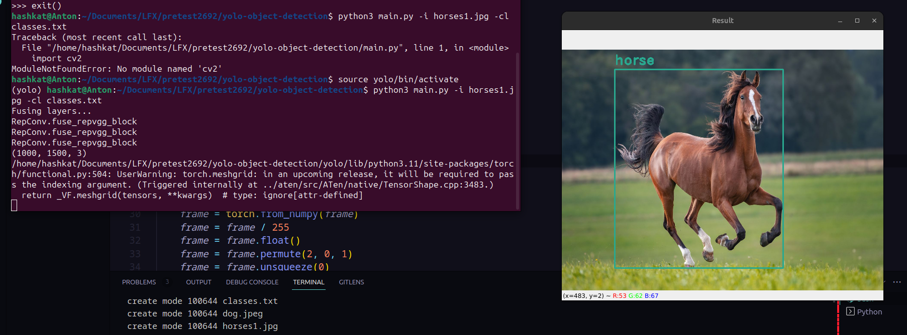
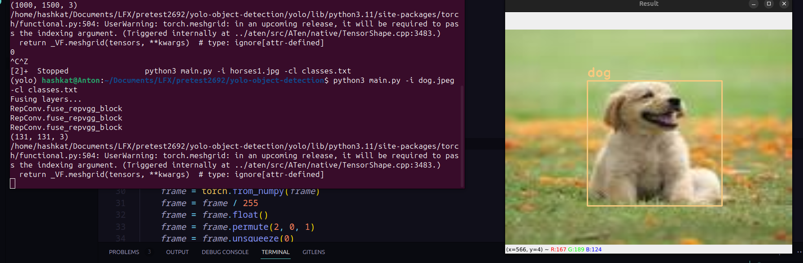

# This is a simple python application which performs Object detection with the help of the YOLO Model

After passing in the arguments of image to perform the object detection on and the class of objects to detect, the application will return the image with the bounding boxes around the objects detected.

Usage:
```bash
pip3 install -r requirements.txt
python3 main.py -i /path/to/image -cl /path/to/classes_text_file
```

Results:



## Porting to Rust

First and foremost we would need to port the preprocessing code from python to rust before running the inference. This can be done with the help of wasmedge_opencvmini plugin.

The opencvmini plugin contains the code for encoding/decoding images as well as other functions such as wasmedge_opencvmini_imshow and wasmedge_opencvmini_waitkey which are used to display the image and wait for a keypress respectively. The above and more functions present in the module shall be used to port the project to Rust.

Reference:
```rust
WasmEdgeOpenCVMiniModule::WasmEdgeOpenCVMiniModule()
    : ModuleInstance("wasmedge_opencvmini") {
  addHostFunc("wasmedge_opencvmini_imdecode",
              std::make_unique<WasmEdgeOpenCVMiniImdecode>(Env));
  addHostFunc("wasmedge_opencvmini_imencode",
              std::make_unique<WasmEdgeOpenCVMiniImencode>(Env));

  addHostFunc("wasmedge_opencvmini_imwrite",
              std::make_unique<WasmEdgeOpenCVMiniImwrite>(Env));

  addHostFunc("wasmedge_opencvmini_blur",
              std::make_unique<WasmEdgeOpenCVMiniBlur>(Env));
  addHostFunc("wasmedge_opencvmini_normalize",
              std::make_unique<WasmEdgeOpenCVMiniNormalize>(Env));
  addHostFunc("wasmedge_opencvmini_bilinear_sampling",
              std::make_unique<WasmEdgeOpenCVMiniBilinearSampling>(Env));

  addHostFunc("wasmedge_opencvmini_imshow",
              std::make_unique<WasmEdgeOpenCVMiniImshow>(Env));
  addHostFunc("wasmedge_opencvmini_waitkey",
              std::make_unique<WasmEdgeOpenCVMiniWaitKey>(Env));
}
```

Alternatively, taking reference to the WASI-NN plugin and mediapipe implementation, we can directly write functions which convert the images to tensors and apply normalisations to them.

Then we can continue to load the model (in our case the attempt_load function which behind the scene just uses pytorch to load the weights and create the network with the Ensemble method). We can load the model with wasi_nn::GRAPH_ENCODING_PYTORCH and wasi_nn::load API.

To get the inference we simply need to call the wasi_nn::compute API with the input tensor and the output tensor. The output tensor will contain the bounding boxes and the class of the objects detected.

Reference: 
```rust
// load model
let graph = unsafe {
  wasi_nn::load(
    &[&weights],
    wasi_nn::GRAPH_ENCODING_PYTORCH,
    wasi_nn::EXECUTION_TARGET_CPU,
  )
  .unwrap()
};
// initialize the computation context
let context = unsafe { wasi_nn::init_execution_context(graph).unwrap() };
// initialize the input tensor
let tensor = wasi_nn::Tensor {
  dimensions: &[1, 3, 224, 224],
  type_: wasi_nn::TENSOR_TYPE_F32,
  data: &tensor_data,
};
// set_input
unsafe {
  wasi_nn::set_input(context, 0, tensor).unwrap();
}
// Execute the inference.
unsafe {
  wasi_nn::compute(context).unwrap();
}
// retrieve output
let mut output_buffer = vec![0f32; 1001];
unsafe {
  wasi_nn::get_output(
    context,
    0,
    &mut output_buffer[..] as *mut [f32] as *mut u8,
    (output_buffer.len() * 4).try_into().unwrap(),
  )
  .unwrap();
}
```

Note: Even after using openCV to preprocess and load the images, the inference HAS to be performed with the help of the WASI_NN module.